# Hull Clearbit Connector

The Clearbit Connector enables sales and marketing teams to enrich customer profiles, reveal anonymous website traffic, find the ideal buyer and discover new accounts.

## Getting Started

Go to the Connectors page of your Hull organization, click the button “Add Connector” and click “Install” on the Clearbit card. After installation, switch to the “Settings” tab and begin with the configuration.

Begin your configuration in the section **Authentication** by copying the Clearbit API key into the provided field. If you are not sure which key to use, see [Find Your Clearbit API Key](#Find-Your-Clearbit-API-Key) for details.
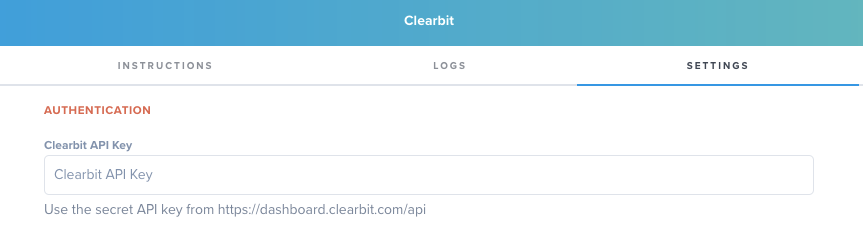
Your Clearbit Connector is now ready to be configured depending on your needs, see Features to learn how to configure the various solutions.

## Features

Clearbit [**Enrichment**](#Enrichment) enables your team to transform the email address of an user in Hull into a complete user and company profile with up to 85 data points.

With Clearbit [**Reveal**](#Reveal) you can turn your anonymous website traffic into company profiles to power targeted campaigns and close more named accounts .

Use the [**Prospector**](#Prospector) to grow your pipeline and find the right buyer within a named account; all you need is a domain name. Our connector enables your team to automatically send revealed companies back to Clearbit and obtain targeted user profiles, no manual work required.

[**Discover**](#Discover) new accounts that are similar to the profiles in any segment defined in Hull. Leverage our advanced segmentation engine to search through over 20M companies.

The Clearbit connector supports to `create users`, `add traits` and `update traits`.

## Find Your Clearbit API Key

You can find your key in your Clearbit dashboard under the API menu link or by navigating to [https://dashboard.clearbit.com/api](https://dashboard.clearbit.com/api). Clearbit provides two keys, a *secret API key* and a *publishable API key*. Use the **secret API key** to integrate Hull with Clearbit:
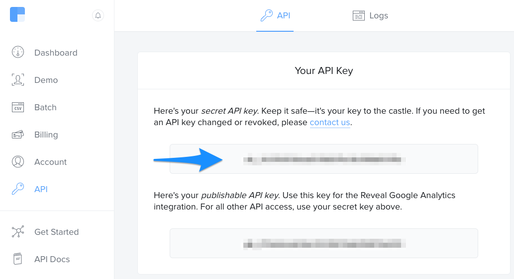

## Enrichment

The Enrichment feature of the connector allows you to complete a users profile with more than 85 data points provided by Clearbit’s API.

**Configure Enrichment**
You can enable or disable this feature by toggling the checkbox in the **Enrichment** section of the Settings tab:
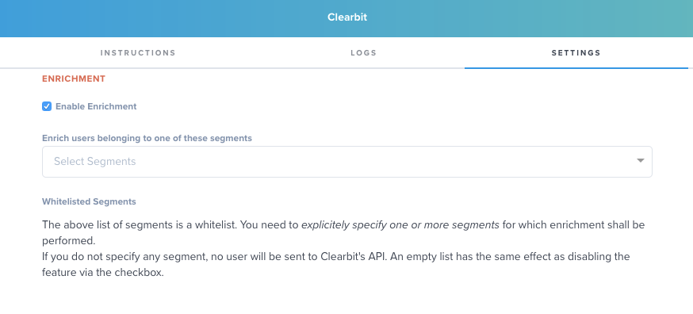

Enrichment is enabled by default but will only result in API calls to Clearbit’s API if you specify at least one segment in the provided field. You can search segments by simply typing a part of the name into the field or by opening the dropdown via the triangular button.
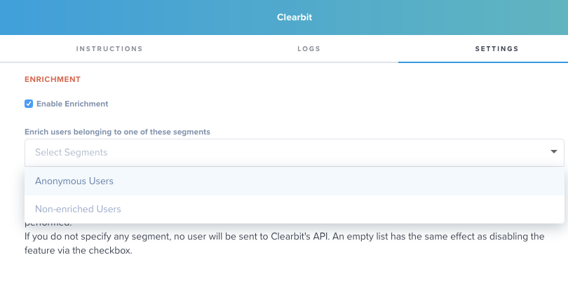

**Which users do get enriched?**
The connector only enriches users who have an *email address* *and have never been enriched before*. The connector sets the trait `clearbit/enriched_at` with the value of the timestamp if the user has been sent to Clearbit’s API.

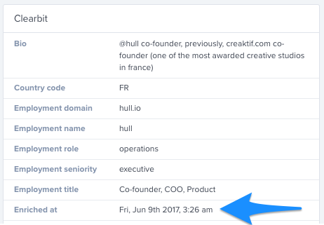

Note: The connector will perform the enrich operation exactly only once, even if this API call does not yield additional data points.

**When do users get enriched?**
The connector attempts the enrichment as soon as the user enters one of the whitelisted segments. Please note that the segment needs to exist before the user gets created, otherwise this automatic enrichment will not be performed. 
You can always enforce the enrichment by selecting one or multiple users on the users page and send them to your Clearbit connector via the “Actions” button. If you perform this route, the whitelisted segments will be ignored and all users that have an email address and no trait `clearbit/enriched_at` will be processed.

Please note that users get only enriched ***exactly once***. Even if this enrichment does not yield any data, the Connector will not run another enrichment.

**How long does it take to enrich users?**
In most cases this process will take no longer than a couple of minutes. In some cases the Clearbit API marks a lookup as pending, which results in a delay of processing for up to an hour.

## Reveal

The Reveal feature of the connector allows you to turn your anonymous website traffic into company profiles to power targeted campaigns and close more named accounts .

You can enable or disable the feature by toggling the checkbox in the **Reveal** section of the Settings tab:

Reveal will turn anonymous users into Company profiles. By default, your Hull organization does not store data about anonymous traffic, so you need to enable “Anonymous Users” for your organization.

Reveal provides you a company profile by performing a reverse IP lookup which provides your sales team the account information, but you can go one step further by automating the process to find prospects for this account. More details, see "How does the Trigger for Prospection work?".

**How to enable Anonymous Users for your organization?** 
You can enable anonymous users or check the feature status within your **Organization Settings**. To access your organization settings, click on Settings in the main menu bar and select the (User) Settings from the menu to the left:
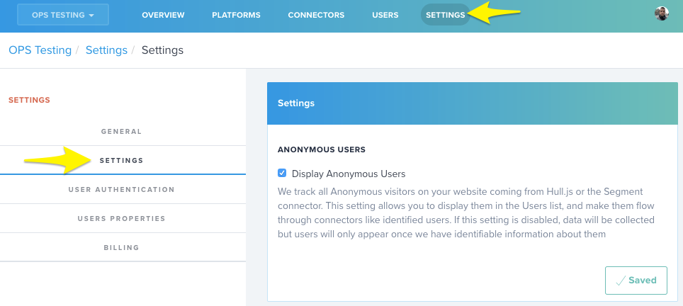

**How does the Trigger for Prospection work?**
The trigger let’s you define when the Clearbit Connector automatically executes the Prospector workflow to find contacts for a revealed account.
You can trigger prospection as soon as the account is revealed by setting the slider to one, or you can require a certain amount of different users visiting your website from the same IP address by adjusting the slider. Selecting a higher value will help to preserve credits but you might not get directly prospects for an account.
Please note, this will only have an effect if the [Prospector](#Prospector) feature is enabled.

## Prospector

The Prospector feature of the connector enables you to grow your pipeline and find the right buyer within a named account by passing along the domain name.

You can enable or disable the feature by toggling the checkbox in the **Prospector** section of the Settings tab:
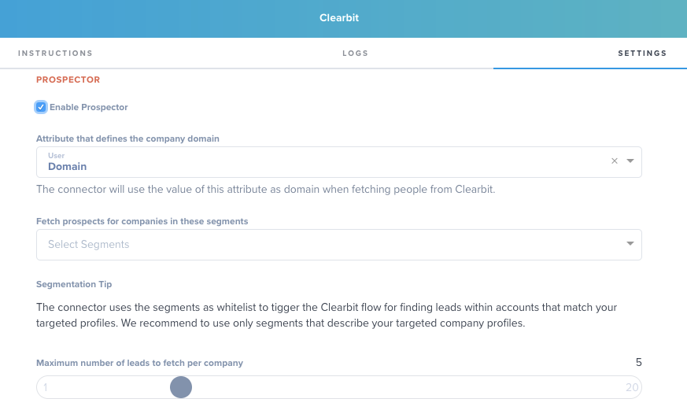

The Prospector will search for contacts within named accounts by passing the domain name of the website along. You can define which attribute you want to use as company domain by picking it from the dropdown list.
If you want to target only accounts that match a certain profile, you can create segments for targeted profiles and restrict the Prospector flow to run only for accounts within those segments.
You can define the maximum number of leads to fetch from Clearbit by adjusting the slider to desired position. This setting will help you to control your costs.

While the general settings control the overall behavior of the connector, you can refine your search by filtering a certain role, seniority, title or any combination of the aforementioned. This will help you to find the people matching your ICP within an account:
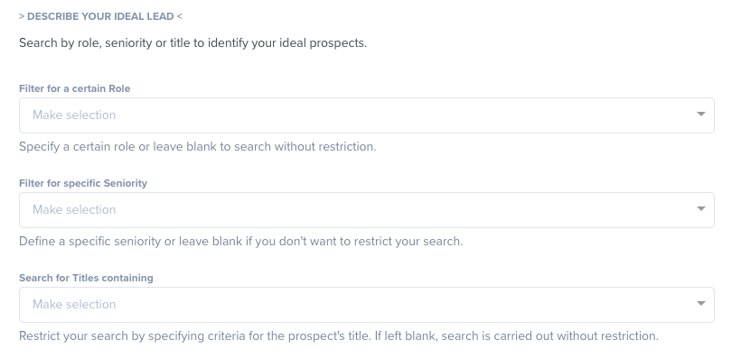

**When does the Prospector workflow run?**
The Prospector workflow gets triggered exactly once per user, if ***all*** of the following conditions are met:

- The user/account does not have the attribute `clearbit/prospected_at` set.
- There are no named users in your Hull organization with the same domain.
- The number of anonymous users has reached the threshold defined via the trigger in the [Reveal](#Reveal) configuration.

**How do I know if the Prospector workflow has been executed?**
The Clearbit Connector sets the attribute `prospected_at` within the Clearbit attribute group that contains the timestamp when prospector has been executed.
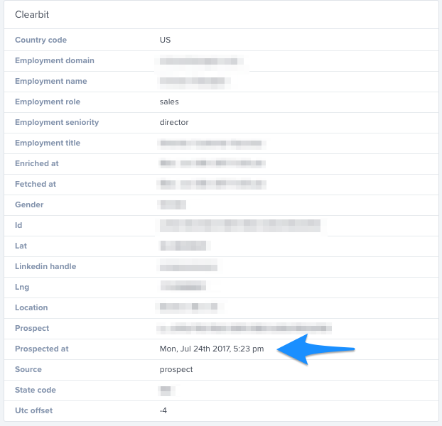

You can use this attribute in your users list to query all users that have this attribute set or where this attribute is unknown.

**Where are the returned prospects stored?**
Leads or prospects returned from Clearbit are stored as users in Hull. You can identify these users by querying your users list with the following restrictions:
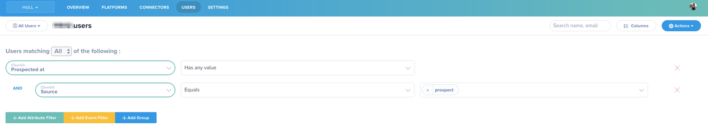

## Discover

The Discover feature of the connector allows you to find new accounts that are similar to the profiles of companies in certain segments.

You can enable or disable the feature by toggling the checkbox in the **Discover** section of the Settings tab:
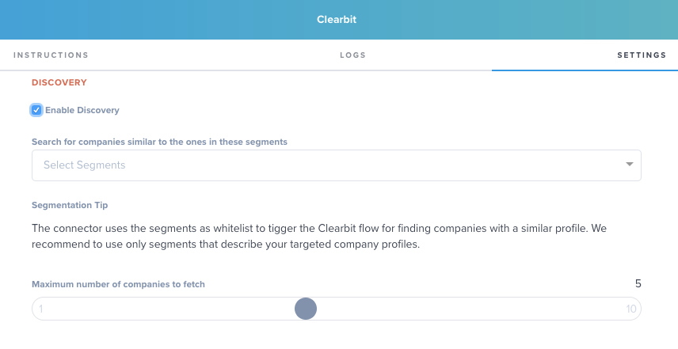

Discovery will search for companies matching your target profile. In Hull you describe your target profile by creating segments. The connector will run the discover workflow for users/accounts who enter one of the matching segments. Similar to the prospection workflow you can limit the number of companies to fetch which helps to control your costs.

**When does the Discover Workflow run?**
The workflow runs as when a new user/account enters one of the whitelisted segments, but only if all of the following conditions are met:

- The user has not been created by the prospector workflow (attribute `clearbit/prospected_at`  is unknown)
- The user has not been created by the discover workflow (attribute `clearbit/discovered_at` is unknown)
